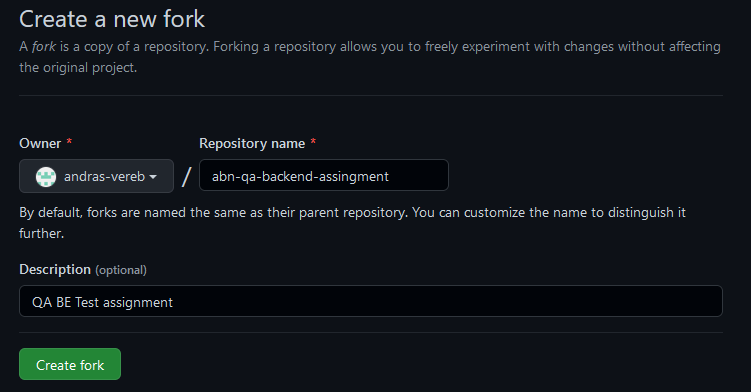
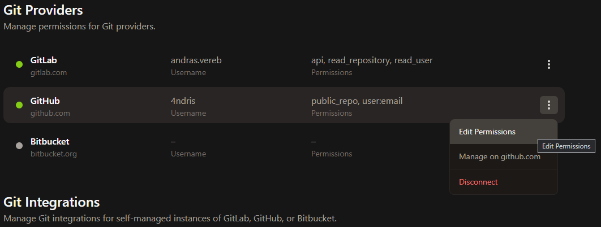
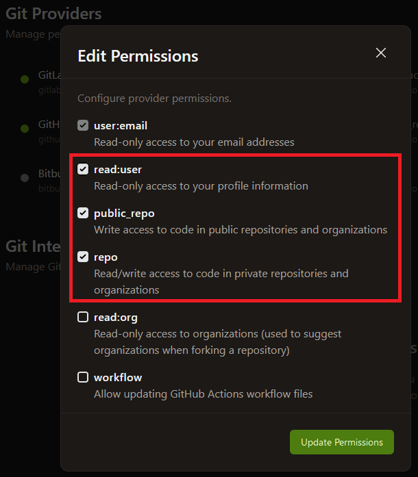

# Backend Test Automation Assignment [](https://gitpod.io/from-referrer/)

<a href="https://gitpod.io/from-referrer/" style="padding: 10px;">
    
</a>

## Requirements
### Environment
* GitHub account
* Java 11 (JDK) (optionally)
* Maven 3.6+ (optionally)
* Any IDE you comfortable with (eg. IntelliJ, VSCode)

### Skills
* Java 8+ (coding standards)
* Clean Code
* Maven
* Git, GitLab, GitHub

### Instructions
Fork this project
<details>
<summary>Example</summary>

   
</details>

#### Working in Web IDE (preferable)

1. Open Project in [GitPod](https://gitpod.io/from-referrer/):
2. Sing-in with GitHub account
3. Create and commit your solution into your forked repository
4. Create documentation in the README.md under the `Documentation` section
5. IMPORTANT: Enable Repository permissions (e.g. git push) for GitPod when coding from Web IDE here:
   https://gitpod.io/integrations
   <details>
   <summary>Details here</summary>

   Edit permission for GitHub:

   

   
   </details>

## Documentation
# Backend Test Automation Assignment [](https://gitpod.io/from-referrer/)

<a href="https://gitpod.io/from-referrer/" style="padding: 10px;">
    
</a>

## Requirements
### Environment
* GitHub account
* Java 11 (JDK) (optionally)
* Maven 3.6+ (optionally)
* Any IDE you comfortable with (eg. IntelliJ, VSCode)

### Skills
* Java 8+ (coding standards)
* Clean Code
* Maven
* Git, GitLab, GitHub

### Instructions
Fork this project
<details>
<summary>Example</summary>

   
</details>

#### Working in Web IDE (preferable)

1. Open Project in [GitPod](https://gitpod.io/from-referrer/):
2. Sing-in with GitHub account
3. Create and commit your solution into your forked repository
4. Create documentation in the README.md under the `Documentation` section
5. IMPORTANT: Enable Repository permissions (e.g. git push) for GitPod when coding from Web IDE here:
   https://gitpod.io/integrations
   <details>
   <summary>Details here</summary>

   Edit permission for GitHub:

   

   
   </details>

## Documentation
# Gitlab issues-api-cucumber-automation-framework 

Gitlab issues API testing using rest-assured

This is a  Rest API test automation solution for endpoints available in https://docs.gitlab.com/ee/api/issues.html


## Technology Stack

- Java
- Cucumber
- Maven
- RestAssured

## Prerequisites
- Java - Version : 11 
- Maven - Version : 3.9.0

## The project directory structure

```bash
src
 + main
    + java                                 
      + utilities                   utility email class
 + test
    + java
      + base                        Contains Enum class and common util methods
      + cucumber.Options            Test runner and cucumber configurations
      + features                    feature file
      + logs                        logs.txt for capturing logs 
      + resources                   property files,Testdata build and common utility methods for testcases.
      + stepdefinitions             Step definitions for the BDD feature

      
```      

## Installation and Test Execution

- Clone the repository with below command

```
git clone -b main https://github.com/shibaharnv/abn-qa-backend-assingment.git

```


Open the project in any IDE Eclipse/IntelliJ.

Navigate to "abn-qa-backend-assingment" folder where we have pom.xml 

Run the following command in Terminal and build the project. It will automatically download all the required dependencies.

```
$ mvn clean install
```

## Execute Tests

Run the below command where "-DRecipientList" parameter value can be updated to your email id.

Test results report link will be sent to the mentioned email id.

### After running the below command please wait for less than a minute for the execution to complete since all the maven logs are captured in project basedir//src/test/java/logs/logs.txt file location.

```mvn -Dcucumber.filter.tags="@Crud or @EdgeCase" test verify --log-file ./src/test/java/logs/logs.txt -DRecipientList="shibaharn@gmail.com"```


```bash
  - Tags.                       -Usage
  Crud                         Create,read,update and delete operations
  EdgeCase                     Edgecases for gitlab issues api
```

##  Docker Image creation and testcase exectution inside docker container

Docker image can be created for this automation project using the below command

```bash
            docker build --no-cache -t {imagename} .

```

All the testcases present in the framework can be executed inside the docker container

####  Docker Container Creation

```bash
            docker create {imagename}
```

####  Testcases execution inside Docker Container

```bash
            docker run {imagename}
```


## Automatic email Generation

Once the execution is done you must be receiving an email with test results link


After clicking the link you should be able to see the report .please refer below screenshot


## Another Detailed report in project directory

Detailed report can be found in /abn-qa-backend-assingment/target/cucumber-html-reports location


##  Gitlab integration for CI CT (.gitlab-ci.yml)

- Gitlab source code (https://gitlab.com/mynewgroupshibahar/gitlabissueapiframeworkabnamro) 

## To run gitlab pipeline to execute testcases 

- Navigate to the below link and run the pipeline by giving your email id - Variable name should be "Email" and value should be "your mail id"

- https://gitlab.com/mynewgroupshibahar/gitlabissueapiframeworkabnamro/-/pipelines/new


Thanks.

Incase of any queries reach out to shibaharn@gmail.com


